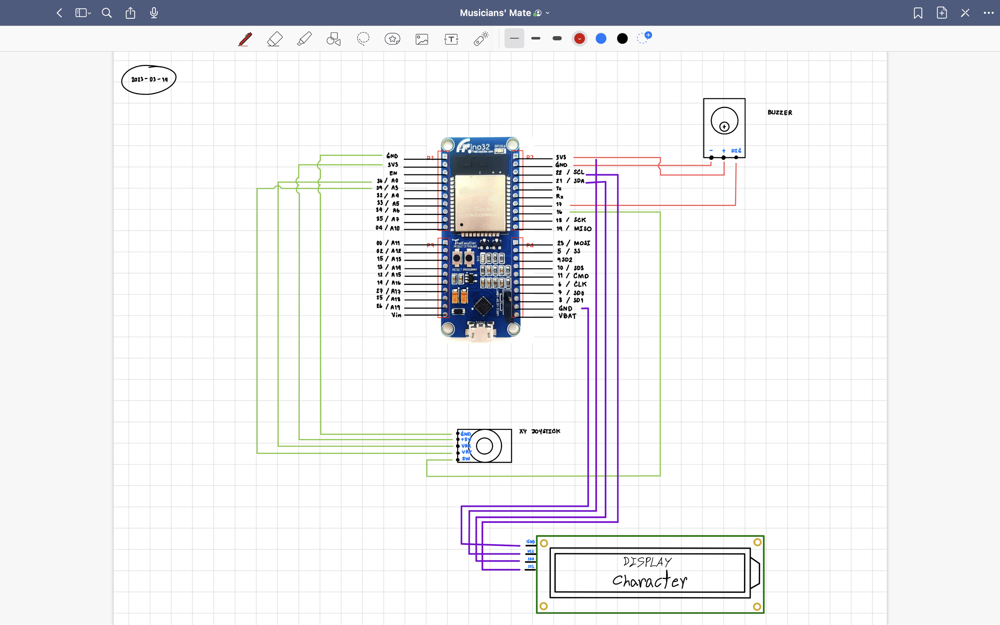

# Musicians' Mate

An IoT Project

## เริ่มต้น

1. ติดตั้ง (เลือกอย่างใดอย่างหนึ่ง)
    1. [Arduino IDE](https://www.arduino.cc/en/software) (แนะนำเวอร์ชันตั้งแต่ 2.0.4 ขึ้นไป)
    1. [Arduino VSCode Extension](vscode:extension/vsciot-vscode.vscode-arduino)
1. คัดลอก folder [`project/MusiciansMate/`](MusiciansMate) ไปไว้ที่ `Arduino/libraries/`
    ของคอมพิวเตอร์ของเรา [ไม่รู้ว่าอยู่ไหน?](https://docs.arduino.cc/hacking/software/Libraries)

    โดยทั่วไปจะอยู่ที่

    - Windows: `My Documents\Arduino\libraries\`
    - macOS: `~/Documents/Arduino/libraries/`

    เช่น

        C:\Users\naiithink\My Documents\Arduino\libraries\MusiciansMate\

1. เปิด sketch/project
    1. [Arduino IDE] เปิด/คัดลอก ไฟล์ [`project/main/main.ino`](main/main.ino) ใน Arduino IDE
    1. [VSCode] เปิด git repository นี้ใน VSCode ที่ติดตั้ง Extension แล้วตามขั้นตอนแรก
1. อัปโหลด > เล่น

## แก้ไข Library

ให้แก้ไขไฟล์ใน `Arduino/libraries/MusiciansMate/` บนคอมพิวเตอร์ของเรา  
เมื่อแก้ไขเสร็จ ให้คัดลอก `Arduino/libraries/MusiciansMate/` ทั้งโฟล์เดอร์ มาวางทับ [`project/MusiciansMate/`](MusiciansMate) แล้ว commit > push

## Pin Layout

